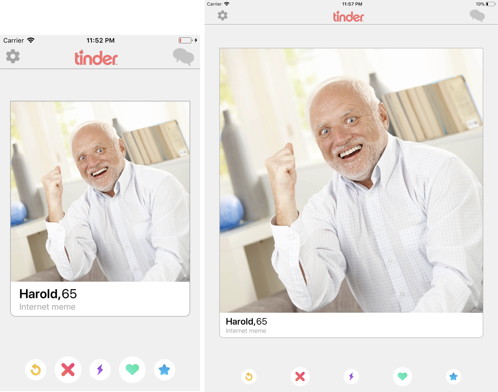
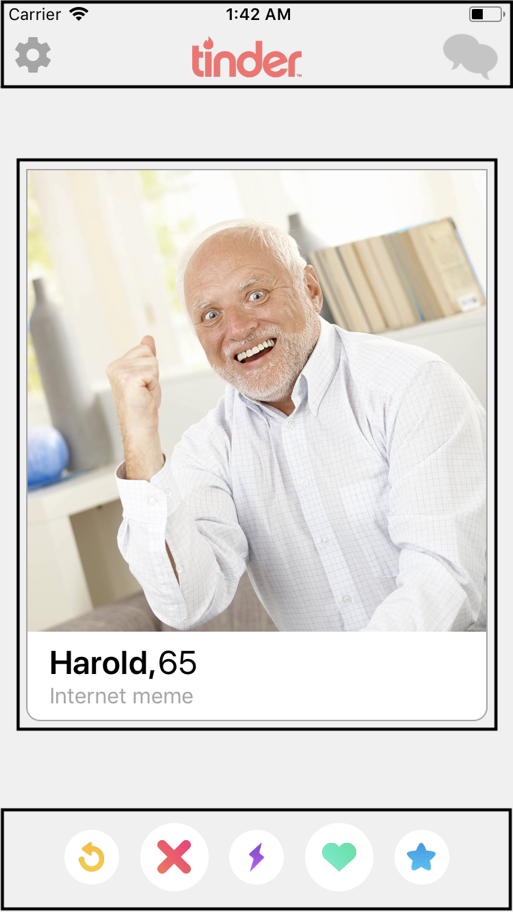

# Assignment 2: A Tender Attempt with RN

Due *Due Date and Time*

## Overview

Imagine working in a team as a mobile developer. You have a team of designers with you. Their task is to design the final version of the application, and your task is to turn the designs into a functional app. Your designers are picky. For the next project, they want you to mimic their specifications exactly. They believe that every pixel matters.

**Your job is to take the design, break it up into pieces, and turn it into code.** There is no need to do it in one run. We understand that working with React Native will look different than other frameworks / programming languages you might be used to, but we hope that this assignment will help you get familiar with the framework.

## Design Details

To get your feet wet, your team of designers have provided these screenshots for you to mimic:

*(mobile device interface on the left, and tablet interface on the right)*

Alas! It’s a Tinder clone. Since this is your first project, the designers intentionally didn’t set any strict sizing, padding, or margin constraints. They want you to interpret the interface seen above and create a responsive application based on it. Your app should look reasonable on different screen sizes (mobile and tablet), and should run on both iOS and Android. You may assume the app will only ever run in portrait mode.

Your designers have left a chart on your desk. It summarizes the following specifications, item by item:

| **Item (with design value)**	| **Description**	|
|---	|---	|
| **Background Color (+0.5)**	| Use any light color of choice. There must be some contrast between the background and the action icons on the bottom of the screen.	|
| **Navigation Bar (+1)**	| *(contains Tinder logo and two adjacent buttons)* Should have a height of 56px on Android and 44px on iOS. *See *[*Platform*](http://facebook.github.io/react-native/docs/platform-specific-code)* module.*	|
| **Tinder Logo (+0.5)**	| Must be centered. Sizing is flexible, though logo should not be distorted.	|
| **Nav. Bar Icons (+0.5)**	| Settings and Chat icons must have a gray tint. Exact color is up to you, but we are a fan of #C5C5C5.    *See tintColor from the* [*styling cheat sheet*](https://github.com/vhpoet/react-native-styling-cheat-sheet)*.*	|
| **Profile Card (+0.5)**	| Matches screenshot. Add a gray border all around (see hex color code above), AND the bottom 2 corners must be rounded.	|
| **Profile Picture (+1)**	| Should scale with screen-size but must always be a square (1:1 aspect ratio).	|
| **Profile Details (+1)**	| Please match the styling of the name, age, and description on the card profile. Although this is flexible, the font-sizes we used are 24 and 16.	|
| **Bottom Action Icons (+2)**	| The five action icons at the bottom of the screen must be in the same order as the screenshot. Notice that the dislike and like buttons are biggest in size. Please match this sizing, though the exact size is up to you.   *You may be wondering how you could draw circles. You can use an *[*Image*](https://facebook.github.io/react-native/docs/image.html)* or a *[*View*](https://facebook.github.io/react-native/docs/view.html)*, and set the border radius equal to half of the length of the side.*	|
| | |

Note that each item includes a design value number. This is representative of how important each element is to the final design of the application and will be used for grading.

You’re welcome to exercise creative freedom for any item that is not listed above. With that said, if you choose to add something new, make sure to report that you have done so and we will give you extra feedback on it.

## Grading

A total of 7 value points can be earned by satisfying each of the design specifications printed above. You will then have an opportunity to earn 6 additional points, as detailed in the following breakdown:

| Description | Points |
|---	|---	|
| Meeting the Design Specifications (matching the screenshot)	| 7 points total	|
| Appropriate use of Stylesheets and Flexboxes	| 2 points	|
| Application runs on iOS and Android (Mobile + iPad)	| 2 points	|
| Appropriate use of components (basic and custom)	| 2 points	|
| **Total**	| **13 points**	|

Note that we want you to get exposure to the intricacies of putting various layouts together. We want you to feel comfortable moving things around and experimenting with different ways to present information in this “Tinder” clone. With that in mind, and up to our discretion, we will be rewarding bonus points for novel solutions and extensions.

## Extensions

Here are some extensions that we’re hoping you consider. Doing so can greatly expand your grasp of this React Native material early on in the quarter:

* Enable the use of all of the buttons in the bottom action bar. Make it so that a “like” or “nope” button action takes the user to the next picture, and an “undo” action moves the user an image back. Experiment with state to see how to achieve this (See Lecture 2B). Getting every button working is worth +2 bonus points. Get creative with the functionality of the other buttons.
* Make the cards swipe-able (animation). This is a good opportunity to experiment with implementing a third party library: [React Native Tinder Swipe Cards](https://github.com/meteor-factory/react-native-tinder-swipe-cards). +3 bonus points can be earned here.

## Implementation Details

Knowing that this was your first time working with React Native, your co-worker left you this short guide on how to best approach the project.

1. **Break up the design into smaller pieces.**
Trying to turn the design into code all at once could turn out messy. Before starting to write code, look at your design and try finding different layouts and boxes that you can use to split your project into parts. Below, we have split the screen into 3 (suggested) main parts. **You can split each of these 3 main parts into more parts. Instead of just drawing boxes, split the large boxes to smaller ones. Your aim is to have every element of the design in a box by itself.**

    

    The three main parts are 1) the navigation bar, 2) the profile picture card, and 3) the bottom buttons bar.

    As a quick side-note, the navigation bar contains the tinder logo and the two adjacent buttons. We think that you should create this component from scratch using a View, Image, and two Buttons. When you implement navigation solutions you will find that the navigation bar is a given and comes naturally. For the time being, it’s okay to mock up what you see above. In practice this gives you flexibility to style your application uniquely.

2. **For each of the three parts, figure out the components you want to use**
Once you have figured out the different elements of the design, and roughly how your layout is going to look like, try to figure out the different components you will be using. This is helpful in starting the coding process.

    For reference, the most important components for this project are the basic components: [View](https://facebook.github.io/react-native/docs/view.html), [Image](https://facebook.github.io/react-native/docs/image.html), [Text](https://facebook.github.io/react-native/docs/text.html), [Button](https://facebook.github.io/react-native/docs/button.html) — though you are NOT limited to using only these.

3. **Write the render function piece by piece**
Choose one of the 3 main parts that we highlighted. Start by creating the parent *View *for this part, then style it, and recurse on its children. Keep in mind that along the way of styling/creating children, you may need to change the style of the parent. This is totally expected since you are relying on flexboxes.

4. **Create Components:**
Once you are done rendering any of the three main parts (navigation bar, the profile picture card, or the bottom buttons bar) turn that part into its own custom component. This will let you organize code by moving relevant pieces into a specific file. See Lecture 2B for an example.

## Resources

Lastly, here’s an invitation to a GitHub repository with the starter files [https://classroom.github.com/a/1tRMQnyQ](https://classroom.github.com/a/1tRMQnyQ). Follow the GitHub guide if you need help getting the assignment and submitting it.

## Submission

To submit, you will need to update your Assignment 2 GitHub repository by **Due Date and Time**. Please see the GitHub Classroom handout for more information.
